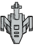
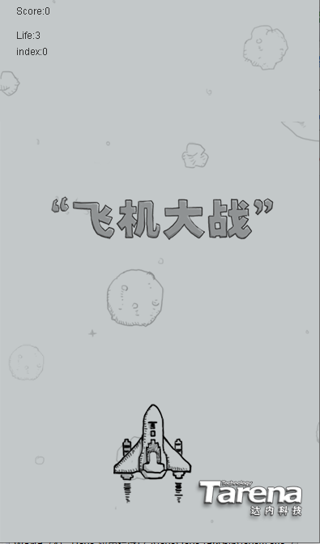
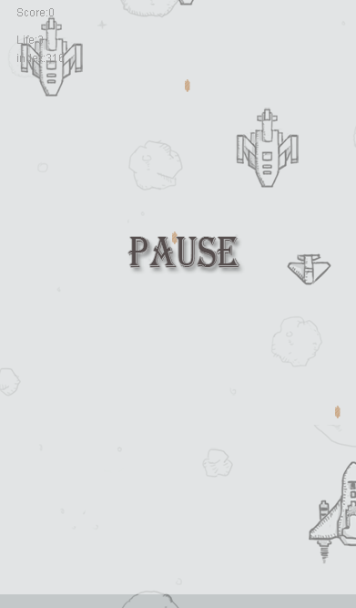
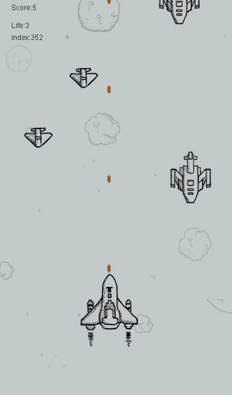
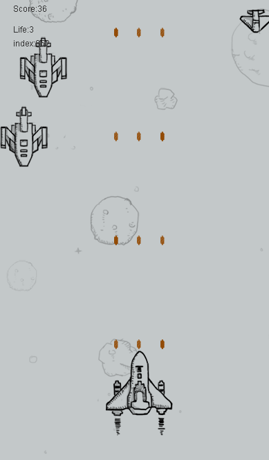
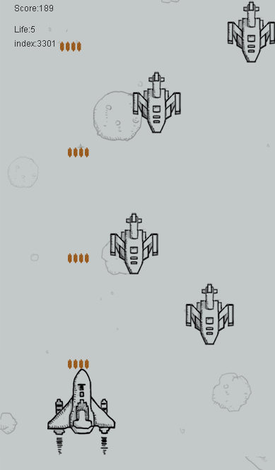
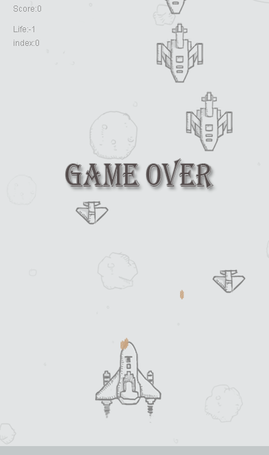
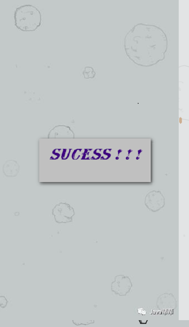

# 飞机大战 （java）

----------

#### 实例图：
###### 小敌机

###### 大敌机

###### 小蜜蜂

		
###### 英雄机

###### 子弹

 

----------

#### 效果图：

###### 开始状态

###### 暂停状态

###### 游戏中（有奖励机制，可以加命或者是升级子弹）

###### 游戏结束

###### 通关

